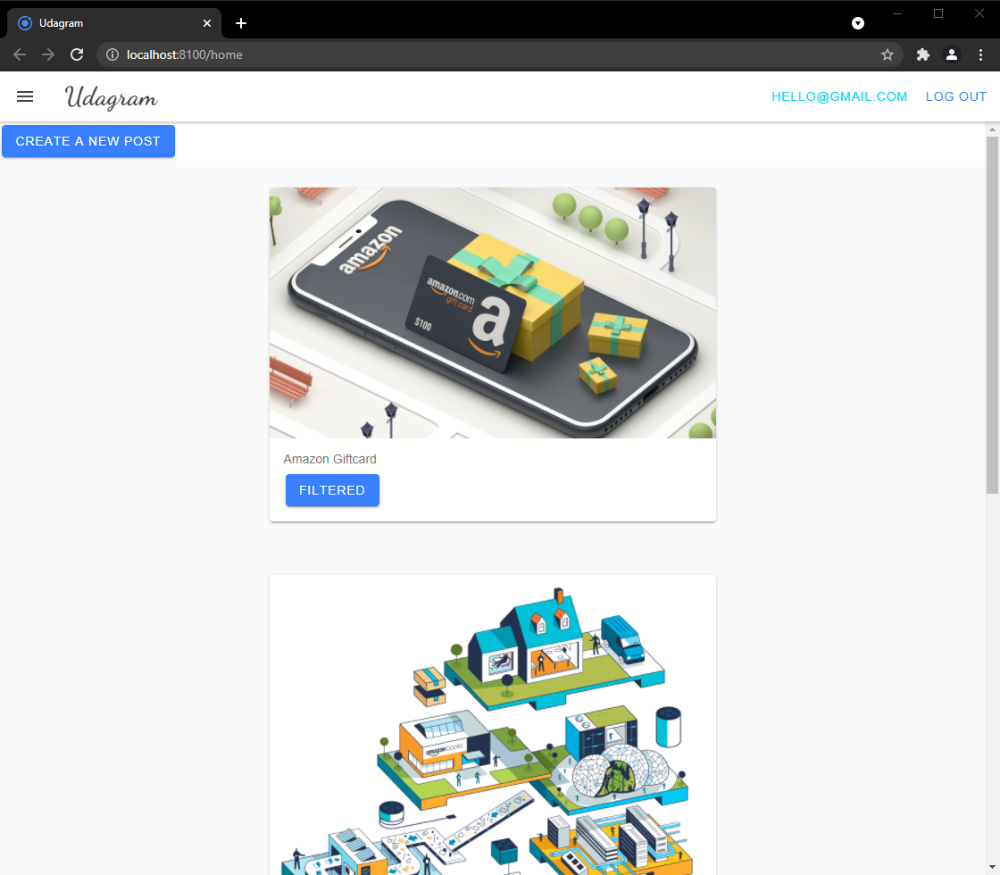
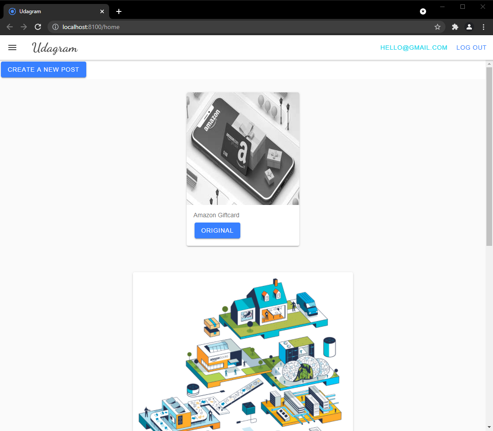
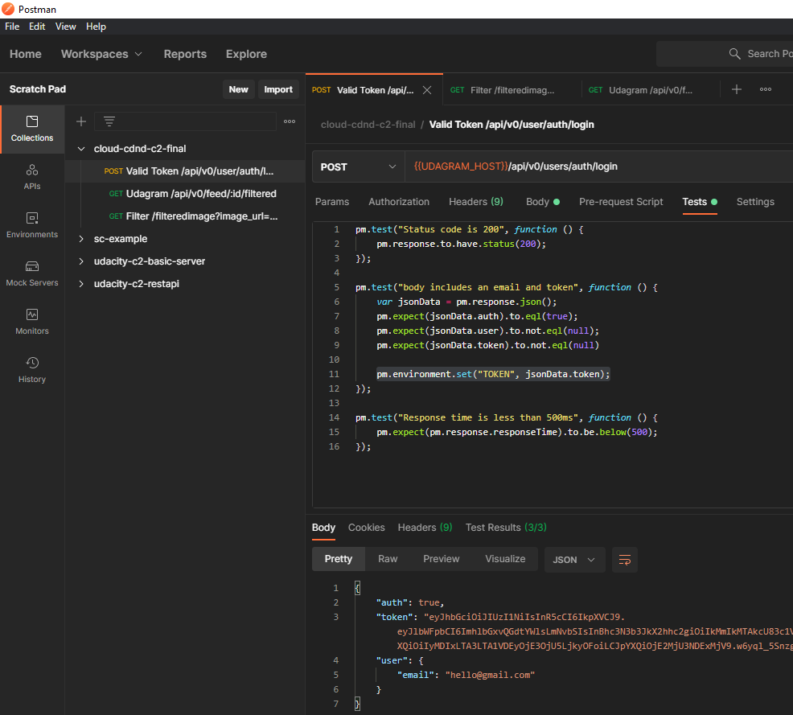
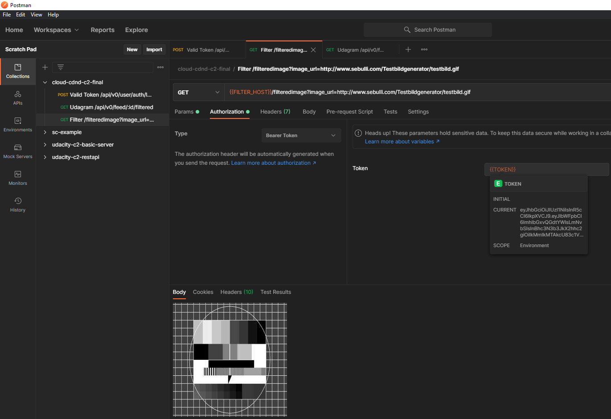

# Github Project
https://github.com/juheba/cloud-developer-nanodegree/tree/master
* master and dev branch
* master contains the up to date code
* Udagram-Server: https://github.com/juheba/cloud-developer-nanodegree/tree/master/part3-full-stack-updagram-on-aws/exercises/udacity-c2-restapi
* Filter-Server: https://github.com/juheba/cloud-developer-nanodegree/tree/master/part3-full-stack-updagram-on-aws/project/image-filter-starter-code
* Both servers can be started with `npm run dev`
* The project was deployed using the AWS Elastic Beanstalk CLI `eb init`, `eb create`, and `eb deploy` commands. See provided screenshots in deployment_screenshot directory.

# Suggestions to Make Your Project Stand Out!
* ✅ Refactor the project built in the course to make a request to this project service upon image upload
  * Udagram-Server: https://github.com/juheba/cloud-developer-nanodegree/tree/master/part3-full-stack-updagram-on-aws/exercises/udacity-c2-restapi got a new Endpoint /api/v0/feed/:id/filtered
  * the Endpoint needs a valid JWT Token as auth header
  * sends the imageurl of the provided feed by id to the Filter Service and returns the filtered image as base64 data url
  * Additional, but not that perfect:
    * Udagram-Frontend: https://github.com/juheba/cloud-developer-nanodegree/tree/master/part3-full-stack-updagram-on-aws/exercises/udacity-c2-frontend has an button on each feed to get a filtered version of the image
    * 
    * 
    * sadly at the moment i was not able to deploy a functional frontend to the aws bucket
    * Frontend itself is accessible but /feed results in an error
    * i need to configure https to communication between frontend and backend (CORS header should be forwarded by CloudFront, but https seems to be missing)
* ✅ Add a required authentication header to block public requests
  * /filterimage needs auth informations
  * Postman Collection contains a request to get an valid auth token (the token is saved as TOKEN environment variable).
  * 
  * 
  * Test the authorized request someone has to trigger both requests: /login then /filteredImage
* ❌ Add your own domain name and have it point to the running services (try adding a subdomain name to point to the processing server) NOTE: Domain names are not included in AWS’ free tier and will incur a cost.

# Important Info

The following file couldn't processed by Jimp.read and results in an Error: Could not find MIME for Buffer <null>
https://upload.wikimedia.org/wikipedia/commons/b/bd/Golden_tabby_and_white_kitten_n01.jpg
even it can be accessed via webbrowser.

See error log after calling Jimp.read:

However other files can indeed be processed.
Some examples:
* https://www.industrios.com/images/news/original/ABC%20Colored%20Bubble%20Letters.jpg from a comment on question https://knowledge.udacity.com/questions/115147
* https://upload.wikimedia.org/wikipedia/en/a/a9/Example.jpg same question
* https://upload.wikimedia.org/wikipedia/commons/thumb/3/3a/Cat03.jpg/1200px-Cat03.jpg from a comment on question https://knowledge.udacity.com/questions/166155

Like other students already pointed out, I've added a little error handling to the provided helper method filterImageFromURL. I'm aware that this is a modification on the provided code.

See snippet:

Or on github:
https://github.com/juheba/cloud-developer-nanodegree/blob/master/part3-full-stack-updagram-on-aws/project/image-filter-starter-code/src/util/util.ts#L12-L21

In server.js an rejected error from filterImageFromURL is catched and results in a 422 response with the error.
https://github.com/juheba/cloud-developer-nanodegree/blob/master/part3-full-stack-updagram-on-aws/project/image-filter-starter-code/src/server.ts#L88-L92

See related questions:
* https://knowledge.udacity.com/questions/120916 comment by Hanna B
* https://knowledge.udacity.com/questions/166155 Rex R and Bertrand N

